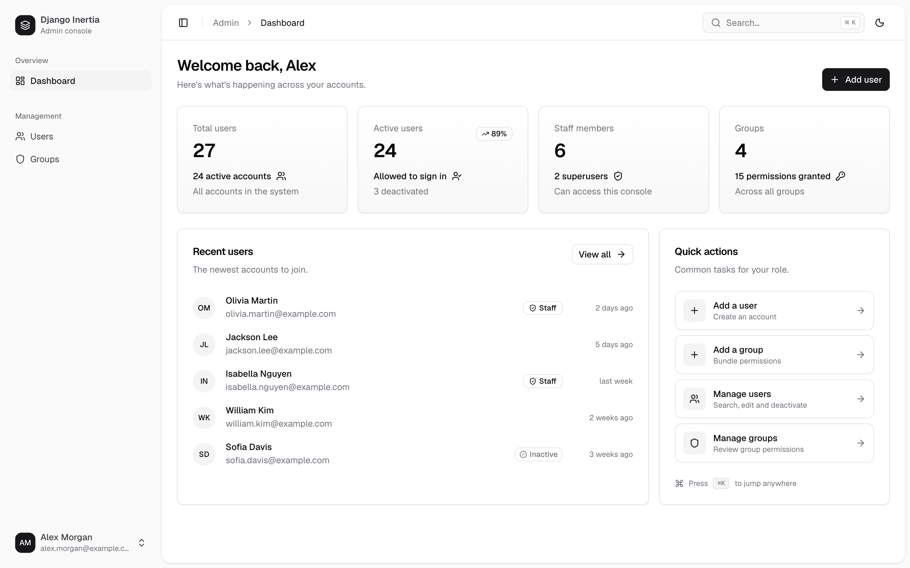
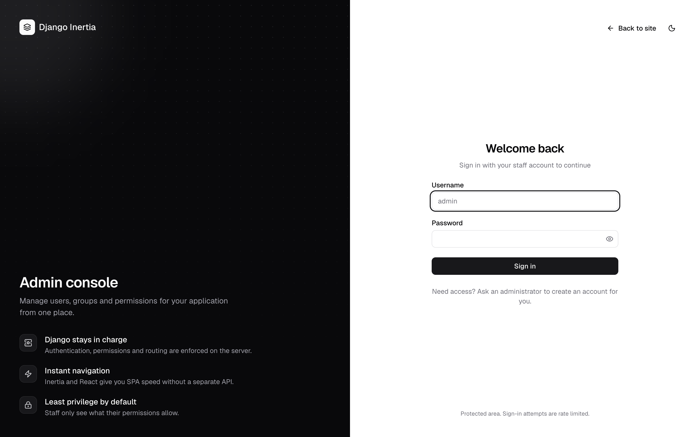
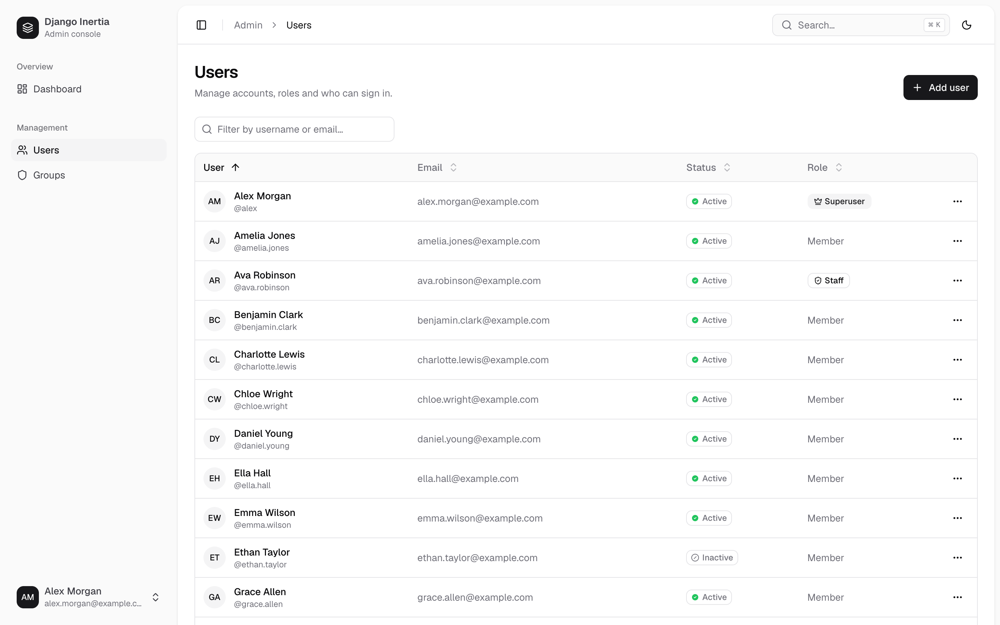
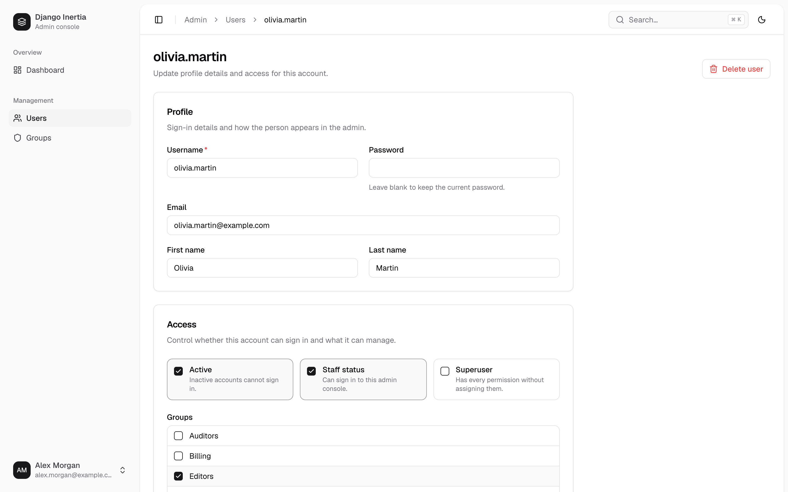
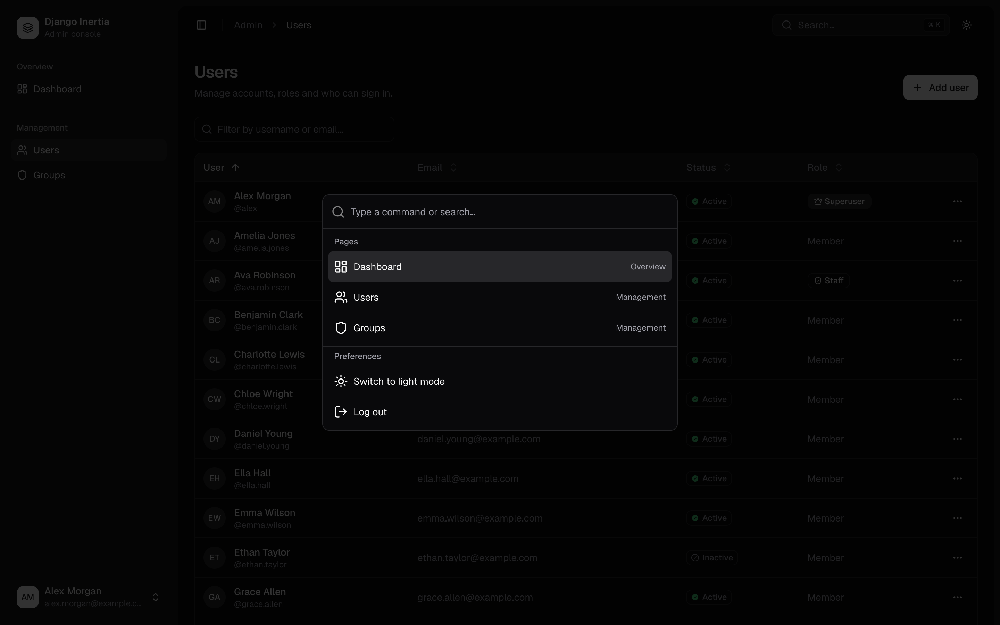
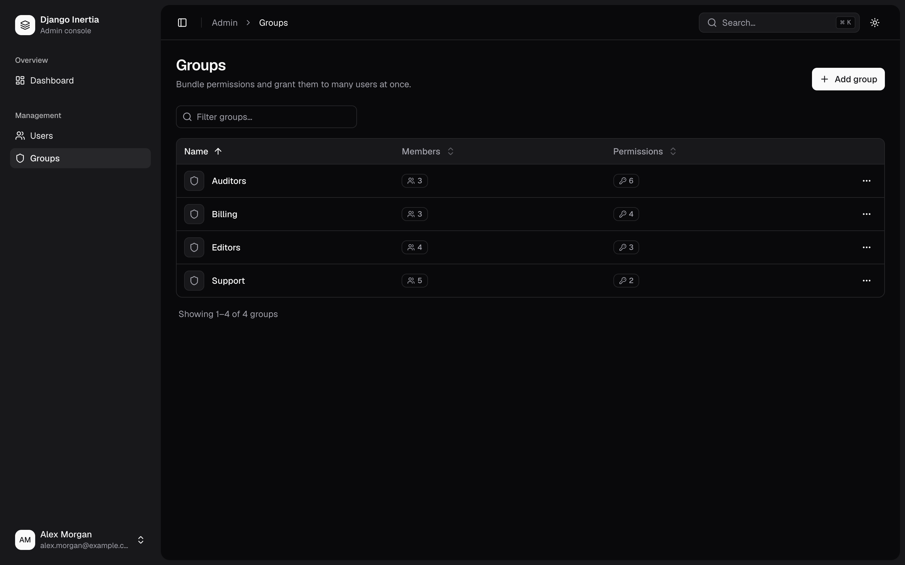
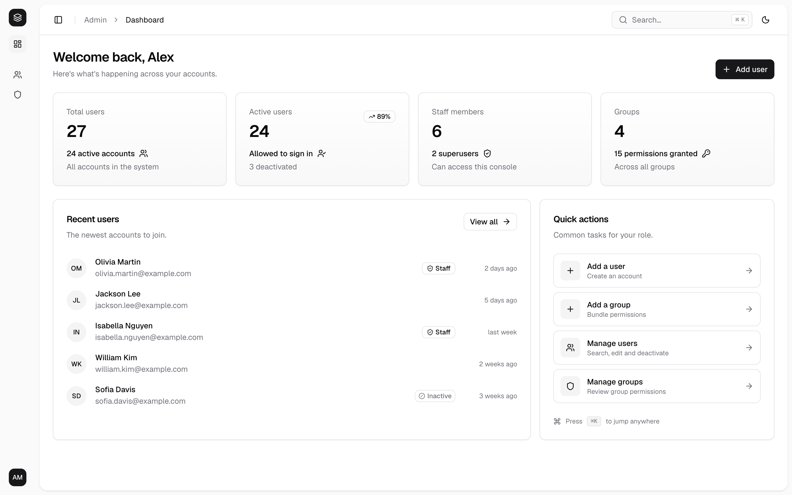
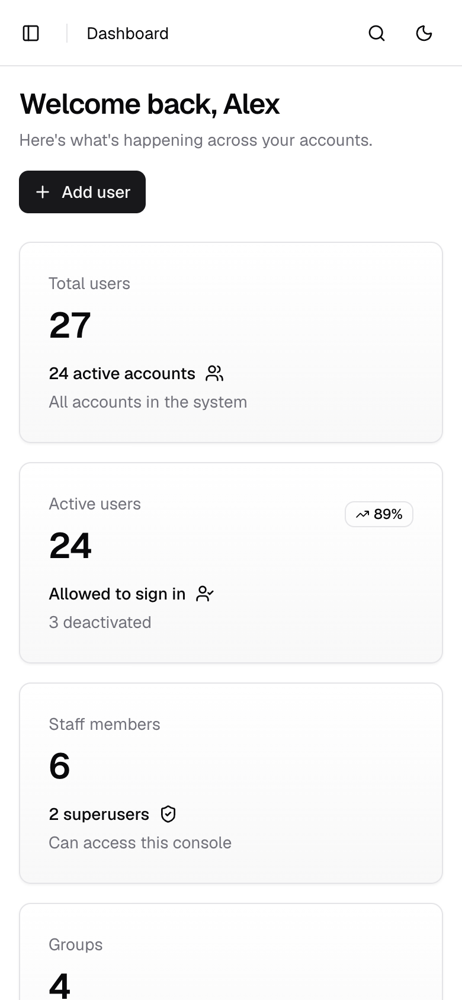
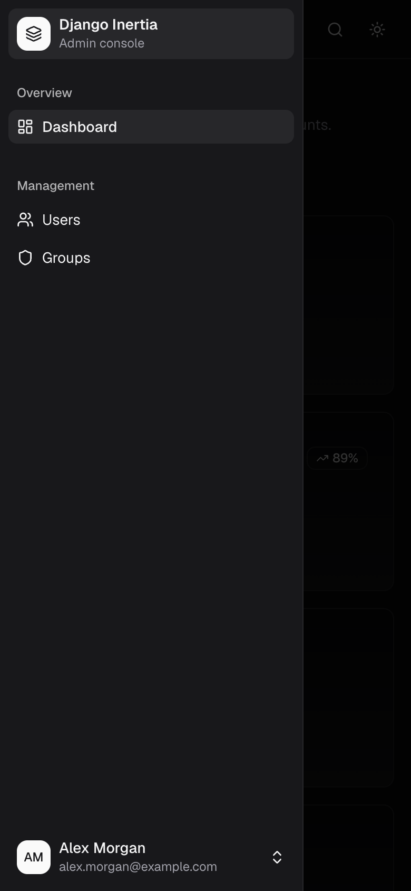

# Django + Inertia + React + shadcn/ui Starter Kit

A full-stack starter for building web apps with **Django** on the backend and **React** on the frontend, glued together by **Inertia.js** — no separate API, no separate SPA deployment. It ships with a production-ready **admin console** built on **shadcn/ui**: users, groups, permissions, light and dark themes.

<picture>
  <source media="(prefers-color-scheme: dark)" srcset="docs/images/dashboard-dark.png">
  
</picture>

## Features

- **Django 6** owns routing, authentication, permissions and validation
- **Inertia.js 2 + React 18** for SPA-speed navigation with server-side routing
- **shadcn/ui** (new-york, zinc) with the Geist font, light and dark themes
- **Admin console** — collapsible sidebar, breadcrumbs, ⌘K command palette, toasts, responsive mobile layout
- **User & group management** — search, sorting, pagination, validation, safe deletes
- **Secure by default** — Django model permissions, superuser-only privilege changes, self-lockout protection, password validation, login throttling, CSRF
- **Clean architecture** — views → services → selectors / policies, with DTOs at the boundaries ([details](docs/architecture.md))
- **Vite 7** dev server with HMR and manifest-based production builds
- **Tested** — 100+ Django tests, ESLint and Vitest on the frontend

## Screenshots

| Sign in | Users |
|---|---|
|  |  |
| **Edit user** | **Command palette (⌘K)** |
|  |  |
| **Groups** | **Collapsed sidebar** |
|  |  |

<p>
  
  &nbsp;
  
</p>

More in the [screenshot gallery](docs/screenshots.md).

## Quick start

**Requirements:** Python 3.12+ ([uv](https://github.com/astral-sh/uv) recommended) and Node.js 20.19+.

```bash
git clone git@github.com:crenspire/django-react-boilerplate.git
cd django-react-boilerplate

# Backend
uv run python starterkit/manage.py migrate
uv run python starterkit/manage.py createsuperuser
uv run python starterkit/manage.py runserver

# Frontend (second terminal)
cd starterkit/frontend
npm install
npm run dev
```

Open **http://127.0.0.1:8000** for the landing page and **http://127.0.0.1:8000/admin/** for the admin console.

The full walkthrough is in [Getting started](docs/getting-started.md).

## Documentation

| Guide | What's inside |
|---|---|
| [Getting started](docs/getting-started.md) | Install, run, create an admin, project layout |
| [Architecture](docs/architecture.md) | Layers and rules, request lifecycle, adding a feature step by step |
| [Permissions](docs/permissions.md) | Who can do what in the admin and how to change it |
| [Frontend](docs/frontend.md) | Admin shell, pages, shadcn/ui components, routes, theming |
| [Configuration](docs/configuration.md) | Environment variables |
| [Deployment](docs/deployment.md) | Production build, static files, security checklist |
| [Testing](docs/testing.md) | Running and writing backend and frontend tests |

## Project structure

```
starterkit/
├── main/                     # Django project: settings, urls, middleware, route map, 
├── apps/admin_panel/         # Admin console
│   ├── api/                  #   views: parse request → call one service → respond
│   ├── services/             #   business logic and page props
│   ├── selectors/            #   all ORM queries
│   ├── domain/               #   permission policies
│   ├── dto/                  #   immutable input/output containers
│   ├── infrastructure/       #   adapters for external systems (cache)
│   └── tests/
├── frontend/                 # React + Vite + Inertia
│   ├── Pages/                #   one component per Inertia page
│   ├── Layouts/              #   AdminLayout, AuthLayout
│   ├── Components/           #   ui/ (shadcn/ui), admin/ (app components)
│   ├── composables/          #   React hooks
│   └── lib/                  #   pure helpers (+ unit tests)
├── templates/base.html       # Inertia root template
└── manage.py
```

## Tests

```bash
uv run python starterkit/manage.py test      # backend

cd starterkit/frontend
npm run lint && npm test                      # frontend
```

## License

MIT. Use this starter for personal or commercial projects.
