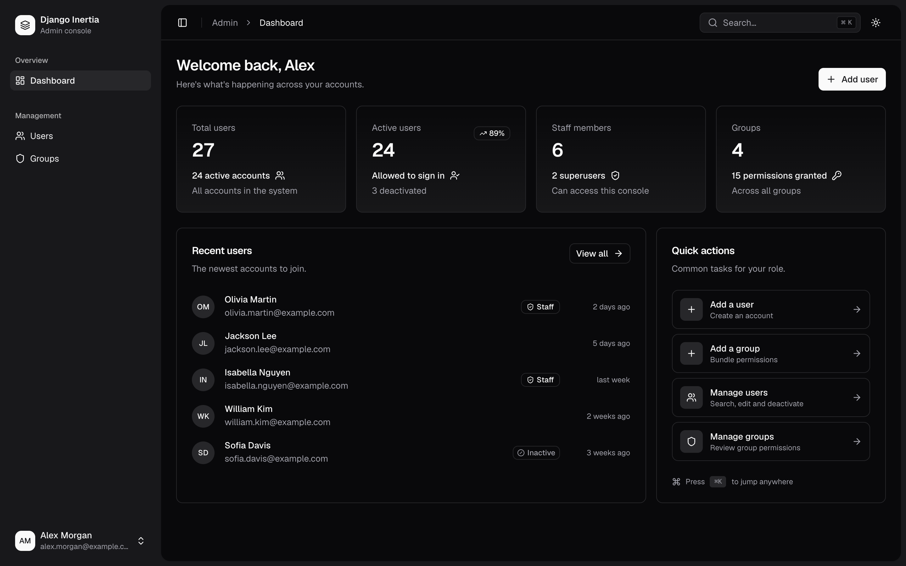
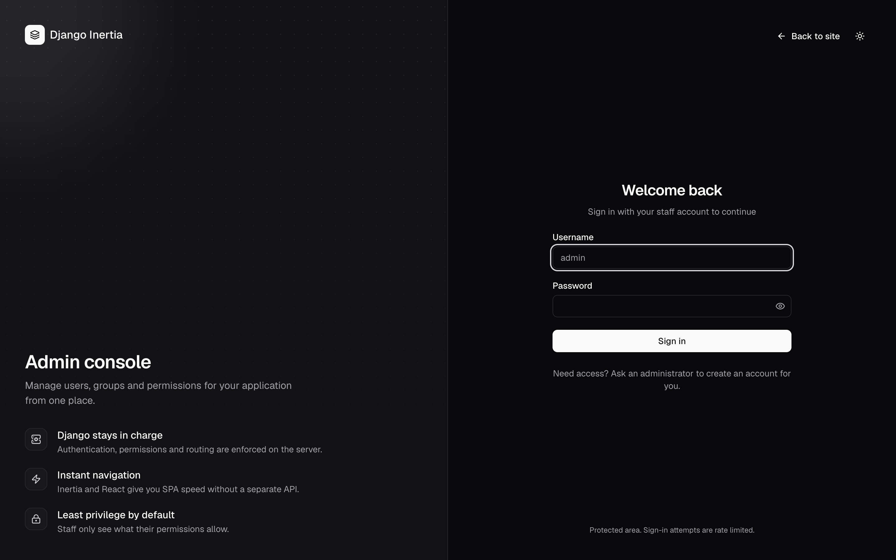
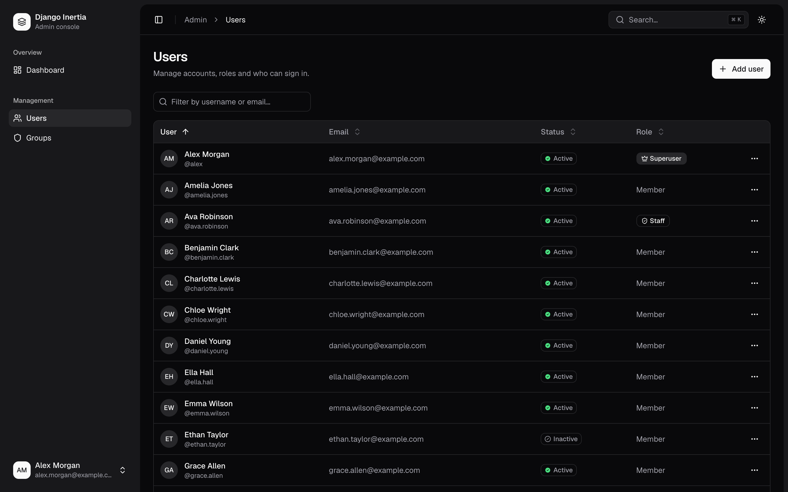
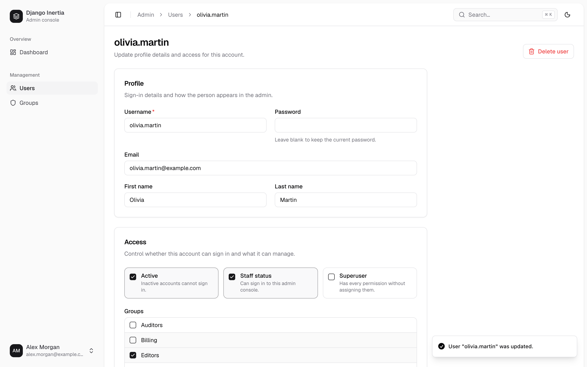
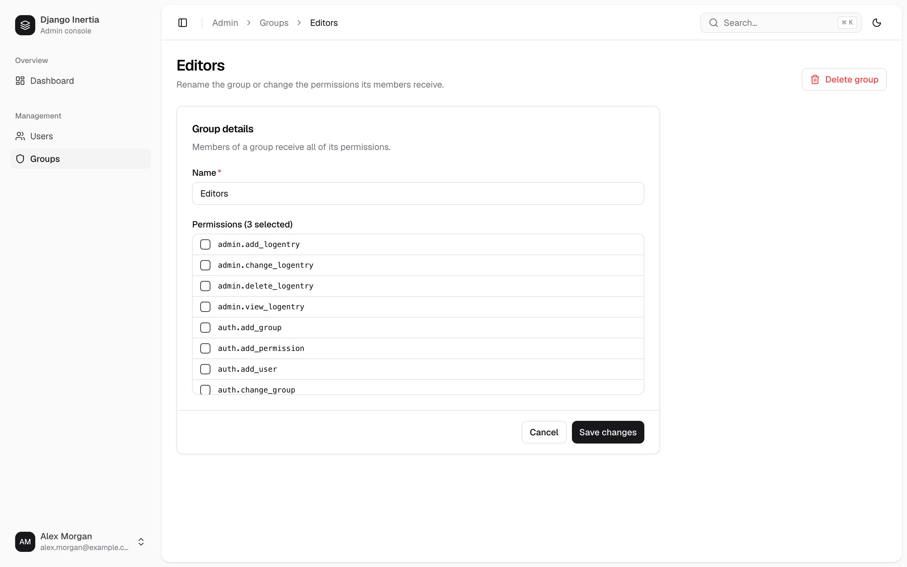
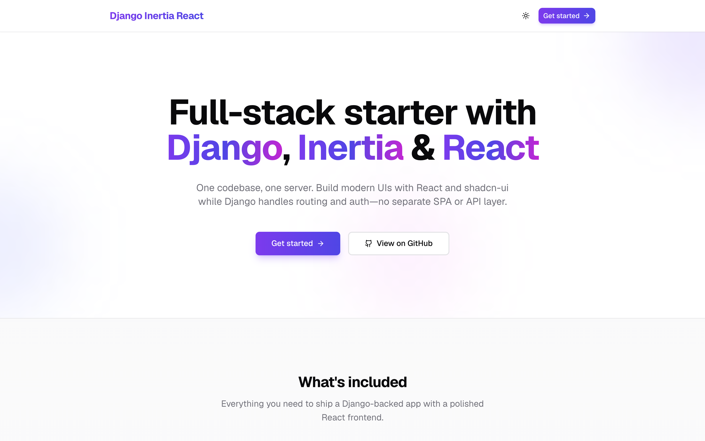
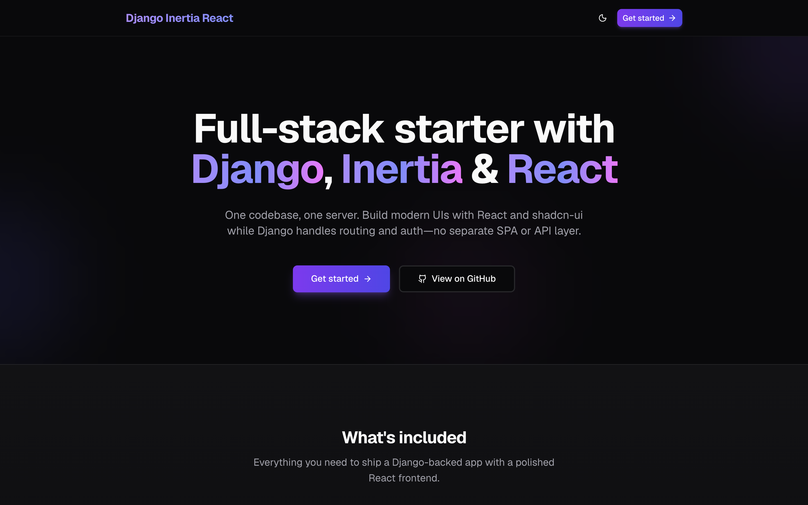

# Screenshots

All screens support light and dark themes. Demo data is fictional.

## Admin dashboard

## Sign in

## Users

## Edit user

## Save confirmation toast

## Groups

## Command palette (⌘K)

## Collapsed sidebar (⌘B)

## Mobile

  
  &nbsp;
  

## Landing page

